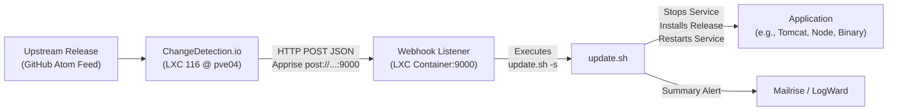

---
tags:
  - automation
  - webhook
  - lxc
  - proxmox
---
# :material-webhook: Automated LXC Update Hooks

This guide explains how automated release updates are architected and configured across homelab LXC web applications using **[webhook][1]** and **[ChangeDetection.io][2]**.

## :bulb: Architecture Overview



1. **Release Detection**: ChangeDetection.io monitors the upstream GitHub Atom feed (`https://github.com/<owner>/<repo>/releases.atom`).
2. **Webhook Trigger**: Upon detecting a new tag, ChangeDetection sends an HTTP POST notification to the target container's webhook listener (`post://<container_ip>:9000/hooks/update-app?method=POST&header=Content-Type:application/json`).
3. **Execution**: The `webhook` binary executes `/root/git/nicholaswilde/homelab/lxc/<app>/update.sh -s` inside the container.
4. **Idempotent Update**: `update.sh` compares the installed version against GitHub API releases. If a new version exists, it stops the service, downloads and installs the release, restarts the service, and fires a summary notification.

---

## :gear: Components

Each integrated LXC application repository folder (`lxc/<app>/`) contains three configurations:

### 1. `hooks.json`

Defines the `update-app` webhook trigger matching the payload sent by ChangeDetection:

```json
[
  {
    "id": "update-app",
    "execute-command": "/root/git/nicholaswilde/homelab/lxc/<app>/update.sh",
    "command-working-directory": "/root/git/nicholaswilde/homelab/lxc/<app>",
    "pass-arguments-to-command": [
      {
        "source": "string",
        "name": "-s"
      }
    ],
    "response-message": "Updating <app>..."
  }
]
```

### 2. Systemd Webhook Service (`<app>-webhook.service`)

Runs the webhook server in background on port `9000`:

```ini
[Unit]
Description=<app> Webhook Listener
After=network.target

[Service]
Type=simple
User=root
Environment=PATH=/usr/local/sbin:/usr/local/bin:/usr/sbin:/usr/bin:/sbin:/bin:/root/.local/bin
WorkingDirectory=/root/git/nicholaswilde/homelab/lxc/<app>
ExecStart=/usr/bin/webhook -hooks hooks.json -verbose -port 9000
Restart=always
RestartSec=5

[Install]
WantedBy=multi-user.target
```

### 3. Taskfile Integration (`lxc/<app>/Taskfile.yml`)

Provides standard targets for managing the webhook daemon:

```yaml
  wh:install:
    desc: Install and start the systemd webhook service
    cmds:
      - cp {{ .SERVICE_NAME }}-webhook.service /etc/systemd/system/
      - systemctl daemon-reload
      - systemctl enable --now {{ .SERVICE_NAME }}-webhook
      - echo "🚀 Webhook service installed and started!"
  wh:logs:
    desc: View the webhook service logs
    cmds:
      - journalctl -u {{ .SERVICE_NAME }}-webhook -f
  wh:status:
    desc: Check the status of the systemd webhook service
    cmds:
      - systemctl status {{ .SERVICE_NAME }}-webhook
  wh:test:
    desc: Test the webhook listener locally
    cmds:
      - 'curl -X POST -H "Content-Type: application/json" http://localhost:9000/hooks/update-app'
```

---

## :rocket: Automation CLI (`scripts/lxc_webhook.py`)

A helper script automates the entire lifecycle:

```shell
# 1. Scaffold files locally
uv run python scripts/lxc_webhook.py scaffold <app>

# 2. Deploy webhook service to container
uv run python scripts/lxc_webhook.py deploy <app> [--node pve04]

# 3. Test listener reachability
uv run python scripts/lxc_webhook.py test <app> [--node pve04]

# 4. Register or update watch in ChangeDetection.io
uv run python scripts/lxc_webhook.py cd-watch <app> --repo <owner/repo>
```

---

## :robot: Antigravity Skill

You can invoke the `webhook-add` agent skill to handle end-to-end integration:

```shell
/webhook add <app_name> <github_repo>
```

Example:

```shell
/webhook add wallos wallosapp/wallos
```

---

## :link: References

- [Adnanh Webhook Documentation][1]
- [ChangeDetection.io Documentation][2]
- [LXC Web Application Version Checker](../apps/drawio.md)

[1]: <https://github.com/adnanh/webhook>
[2]: <https://changedetection.io/>
